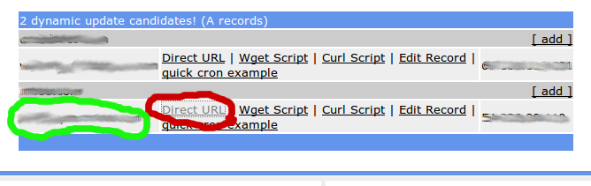

# OpenVPN Community Edition on an AWS EC2 instance
This project sets up an OpenVPN server on an EC2 instance that can be
used to reduce the risk of using open and public WiFi access points.
[Recommendations][1] [for using a VPN][2] are common and wide spread
simply search for `how to safely use public wifi`. 

This project sets up a VPN on an Amazon EC2 compute instance. The VPN is
community edition of [OpenVPN][ovpn]. It will be deployed on
[Ubuntu][ubunut]
because I am familiar with Ubuntu, there are packaged versions of
OpenVPN in the distro repository, and there is a Amazon Machine Image
(AMI) for Ubuntu that is elible for the [AWS Free Usage Tier][awsfree].

##### Table of Contents  
* [Preparation](#preparation)  
   * [AWS Account](#aws)
   * [Certificates](#certs)
     * [Setup](#setupCA)
     * [Server Certificate](#serverCert)
     * [Client Certificate](#clientCert)
   * [DDNS Hostname](#DDNSHost)
   * [SSH Key](#sshkey)
* [Launch EC2 Instance](#launchec2)
* [Configure Server](#setupServer)
* [Configure Client](#setupClient)
  * [Ubuntu](#ubuntuClient)
  * [Android](#androidClient)
* [Stop/Start EC2 Instance](#startStop)

## Preparation
<a name="aws"><a/>
### AWS Account
AWS account setup is not covered here, but is well documented at the
[AWS web site](https://aws.amazon.com/). These links are good starting points:

  * [AWS Free Usage Tier](http://aws.amazon.com/free)
  * [Getting Started](http://docs.aws.amazon.com/AWSEC2/latest/UserGuide/EC2_GetStarted.html)

<a name="certs"/>
### Credentials
[Easy-RSA][easyrsa] is used to create and sign the credentials. Easy-RSA
is included in the openvpn package on Ubuntu 12.04. On Ubuntu 14.04 it
is a separate package. Some guides (the [Ubuntu Guide][ubuntu_openvpn]
for example) use Easy-RSA from those packages and create the credentials
on the server itself. This project will create the credentials on your
local host both to minimize the work on the server and to keep
unnecessary sensitive files off the server.

<a name="setupCA"/>
#### Setup
Download a release tarball from
https://github.com/OpenVPN/easy-rsa/releases. These instructions are
for
[v2.2.2](https://github.com/OpenVPN/easy-rsa/releases/tag/2.2.2)

    $ tar -xzf EasyRSA-2.2.2.tgz
    $ cd EasyRSA-2.2.2/

Edit the `vars` file and adjust the following to your environment. If
its not clear to you what the value _should_ be, you can use an
arbitrary string (such as `MyVPN`). The values aren't that important
unless you are going to be signing things for others.

    export KEY_COUNTRY="US"
    export KEY_PROVINCE="NC"
    export KEY_CITY="Winston-Salem"
    export KEY_ORG="Example Company"
    export KEY_EMAIL="steve@example.com"
    export KEY_OU=MyVPN
    export KEY_NAME=MyVPN
    export KEY_CN=MyVPN

Now generate the master Certificate Authority (CA). The values you
adjusted in the `vars` file will be the default answers to the questions
asked by `./build-ca`.

    $ source ./vars
    $ ./clean-all
    $ ./build-ca

The resulting CA file is `keys/ca.crt`.

<a name="serverCert"/>
#### Server
Next build the server certificate and the Diffie Hellman parameters
file. `myserver` will be used to construct the file names for the
server certificate and key, if you use a differnet value you will need
to modify the `server.conf` file.

Accept defaults for all the values, leaving the _challenge password_ and
_optional company name_ empty. You will have to answer `y` to the `Sign
the certificate?` and `1 out of 1 certificate requests certified,
commit?` questions.

    $ ./build-key-server myserver
    $ ./build-dh

The files your are going to use are: `keys/myserver.crt`,
`keys/myserver.key`, and `keys/dh2048.pem`.

<a name="clientCert"/>
#### Client
You will need at least one client certificate, but it is a good idea to
use a different certificate for each of your computers and mobile
devices. There are several EasyRSA scripts to build the client
certificates. Creating a PKCS#12 archive simplifies installing the keys
and since it is an encrypted archive it can be safely moved over
insecure channels. 

`clientID` will used as part of the certificate file name. Accept the
default values, leave _challenge password_ and _optional company anem_
empty. Answer `y` to the `Sign the certificate?` and `1 out of 1
certificate requests certified, commit?` questions.

**DO NOT FORGET THE Export Password**

    $ cd EasyRSA-2.2.2/
    $ ./build-key-pkcs12 clientID

There is only one file you will need: `keys/clientID.p12` where
`clientID` is the argument you specified.

<a name="DDNSHost"/>
### DDNS Hostname
This is somewhat optional. If you don't want to setup a dynamic DNS host
name, you can use an ElasticIP or even the public IP assigned when the
EC2 instance gets started. The down side of the ElasticIP is that it
costs you money when you EC2 instance is not running. The down side of
the EC2 public IP is that it changes every time the instance is stopped
and restarted. You will have to update the configuration files on the
instance and on your clients each time you stop and start the EC2
instance.

It is much easier to a use a dynamic DNS (DDNS) service. The scripts in this
project will automatically update the IP address at the DDNS when the VPN is
started. These scripts are specific to
[freeDNS][freedns], but should be easy to modify for other services.

Use the fully qualified host
name (circled in green) and the URL associated with the `DirectURL` link
(circled in red) from the this table on the [freeDNS][freedns] [Dynamic
DNS](http://freedns.afraid.org/dynamic/) page to configure `dynamicSetup.sh` and `client.ovpn`.

  * Edit `dynamicSetup.sh` and set `DDNS_URL`.

  * Edit `client.ovpn` and replace `SERVER_DNS_OR_IP` with the fully qualified host name of your server

<a name="launchec2"/>
## Launch EC2 Instance

* [Launch EC2 Instance](#launchec2)
* [Configure Server](#setupServer)
<a name="#setupServer"/>
## Configure Server
<a name="#setupClient"/>
## Configure Client
<a name="#ubuntuClient"/>
### Ubuntu
<a name="#androidClient"/>
### Android
<a name="#startStop"/>
## Stop/Start EC2 Instance]

------------------
[1]: http://arstechnica.com/security/2011/01/stay-safe-at-a-public-wi-fi-hotspot/ "arstechnica: How to stay safe at a public WiFi hotspot"
[2]: http://consumerist.com/2008/10/06/the-idiot-proof-way-to-securely-use-public-wi-fi/ "Consumerist: The Idiot-Proof Way to Securely Use Public WiFi"
[ovpn]: http://openvpn.net/index.php/open-source.html
[ubuntu]: http://www.ubuntu.com/server
[awsfree]: http://aws.amazon.com/free/
[freedns]: http://freedns.afraid.org
